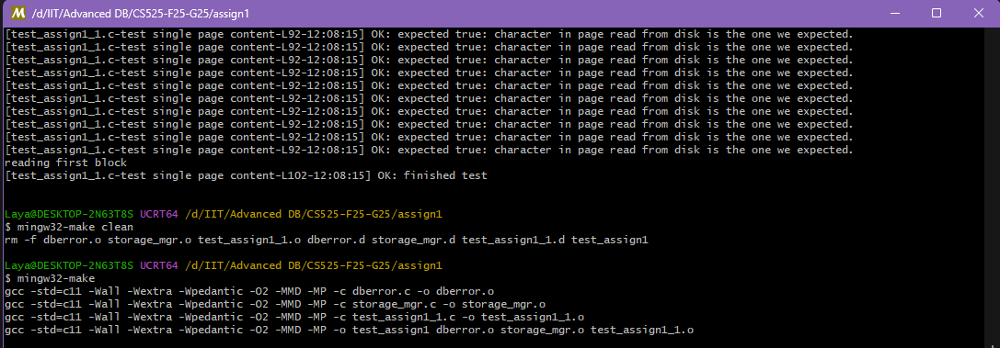
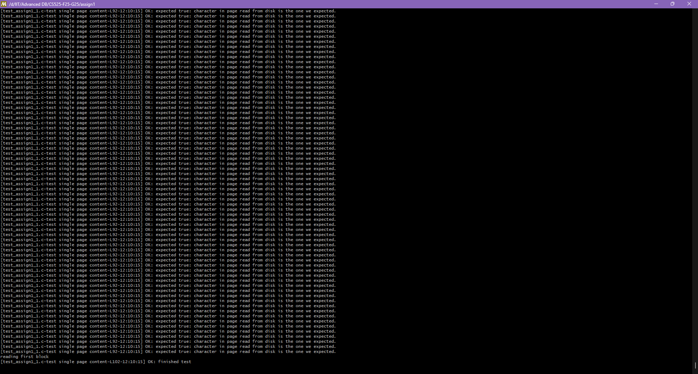

# CS525 – Assignment 1: Storage Manager

## Build & Run Instructions

### 1. Clone or extract the code
```bash
git clone (https://github.com/CS525-ADO-F25/CS525-F25-G25.git)
cd CS525-F25-G25/assign1
````

### 2. Dependencies

* **Linux/macOS/WSL**

  * GCC (version 9+ recommended)
  * GNU Make
  * No external libraries beyond the standard C library

* **Windows**

  * Install [MSYS2](https://www.msys2.org/)
  * Use the **UCRT64** or **MinGW64** shell
  * Install build tools:

    ```bash
    pacman -S --needed mingw-w64-ucrt-x86_64-gcc mingw-w64-ucrt-x86_64-make
  * Use `mingw32-make` instead of `make`

### 3. Build the project

* On **Linux/macOS/WSL**:

  ```bash
  make
* On **Windows (MSYS2)**:

  ```bash
  mingw32-make
This creates an executable named `test_assign1` (or `test_assign1.exe` on Windows).

### 4. Run the tests

* On **Linux/macOS/WSL**:

  ```bash
  ./test_assign1
* On **Windows**:

  ```bash
  ./test_assign1.exe
Expected output: multiple `OK:` lines from the provided tests (`testCreateOpenClose`, `testSinglePageContent`) confirming that page files are created, read, written, and destroyed correctly.

### 5. Clean & rebuild (optional)

* Linux/macOS/WSL:

  ```bash
  make clean && make
* Windows (MSYS2):

  ```bash
  mingw32-make clean && mingw32-make
---

## Code Structure

```
assign1/
  dberror.h        # error codes, PAGE_SIZE, error handling macros
  dberror.c        # error message utilities
  storage_mgr.h    # interface definition (provided)
  storage_mgr.c    # implementation (FILE* in mgmtInfo, all API functions)
  test_helper.h    # macros for testing
  test_assign1_1.c # provided test cases
  Makefile         # builds the test executable
  README.md        # this file
```

---

## Function Explanations

### File management

* **initStorageManager()**
  Initializes the storage manager. Currently a no-op, but sets up global state if needed.

* **createPageFile(fileName)**
  Creates a new page file with exactly one zero-filled page (4096 bytes).

* **openPageFile(fileName, fHandle)**
  Opens an existing file in `rb+` mode.
  Initializes the file handle:

  * `fileName` (duplicated and stored)
  * `totalNumPages = filesize / PAGE_SIZE`
  * `curPagePos = 0`
  * `mgmtInfo` stores a pointer to `FILE*`.

* **closePageFile(fHandle)**
  Closes the file, frees the `mgmtInfo` struct, frees the duplicated `fileName`, and resets the fields.

* **destroyPageFile(fileName)**
  Deletes the file from disk. Returns `RC_FILE_NOT_FOUND` if the file cannot be removed.

---

### Reading

* **readBlock(pageNum, fHandle, memPage)**
  Reads the page at position `pageNum` into `memPage`. Updates `curPagePos`.
  Returns `RC_READ_NON_EXISTING_PAGE` if out-of-bounds.

* **readFirstBlock / readLastBlock / readCurrentBlock / readNextBlock / readPreviousBlock**
  Convenience wrappers around `readBlock` that read relative to the current position.

* **getBlockPos(fHandle)**
  Returns the current page position (`curPagePos`).

---

### Writing

* **writeBlock(pageNum, fHandle, memPage)**
  Writes the contents of `memPage` into the page at index `pageNum`. Updates `curPagePos`.
  Returns `RC_WRITE_FAILED` if out-of-bounds or write fails.

* **writeCurrentBlock(fHandle, memPage)**
  Writes to the current page (`curPagePos`).

---

### Growing the file

* **appendEmptyBlock(fHandle)**
  Appends a new page filled with zeros to the end of the file. Increments `totalNumPages` and sets `curPagePos` to the new last page.

* **ensureCapacity(N, fHandle)**
  Ensures the file has at least `N` pages. If not, repeatedly calls `appendEmptyBlock`.

---


### Screenshot of Output




---

## Video Demonstration

**Video Demo Link:** (https://www.loom.com/share/6671bf01356f4cebb2ff2b38b2d43553?sid=d051efe1-0df5-4a91-af51-d69fc4c8a366)

---

## Notes & Design Choices

* `openPageFile` duplicates `fileName` (`strdup`) to ensure safe lifetime; freed in `closePageFile`.
* Defensive checks:

  * Validate `NULL` handles and `NULL` page buffers.
  * Reject files whose size is not a multiple of `PAGE_SIZE`.
* `appendEmptyBlock` and `ensureCapacity` grow the file by writing zeroed pages.
* `curPagePos` is always updated consistently after reads and writes.

